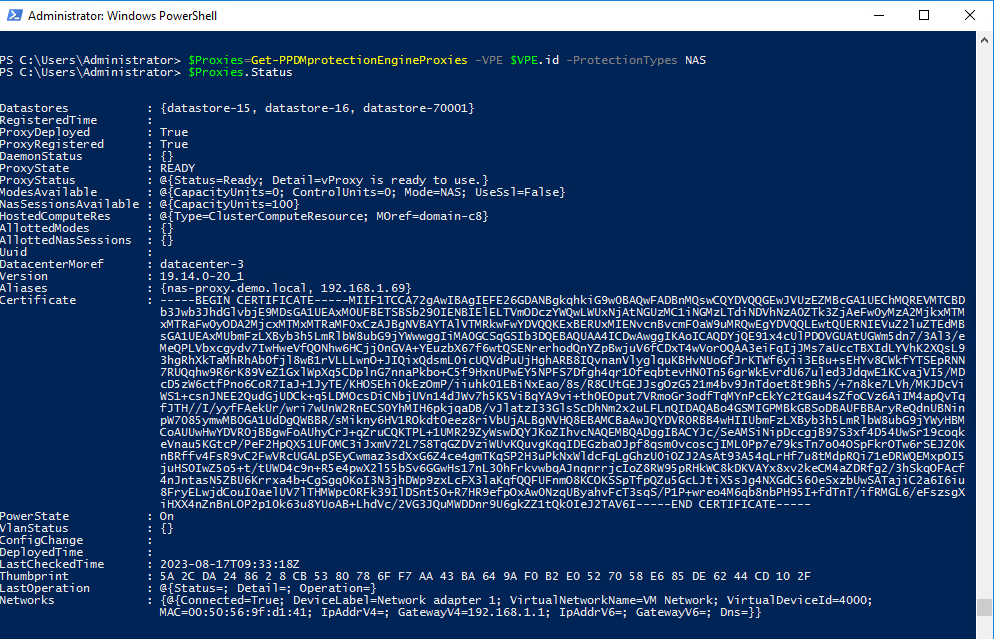
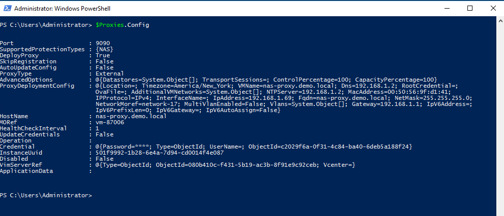

# MODULE 10 - DYNAMIC NAS PROTECTION

## LESSON 1 - REVIEW NAS PROXY AND ASSETS

## Viewing NAS Assets and Asset Sources

View explicit Powerstore NAS system with Name isilon.demo.local:

```Powershell
Get-PPDMAssetSource -Type POWERSCALEMANAGEMENTSERVER -filter 'name eq "isilon.demo.local"'
```


View all NAS Assets

```Powershell
Get-PPDMassets -type NAS_SHARE | ft name, id, status, protectionStatus
```


## View NAS Proxies

The Provies are managed via the embedded Protection Engine, the VPE
First, we get the VPE with its ID:

```Powershell
$VPE=Get-PPDMprotection_engines
$VPE
```


Next, we get the NAS Protection Engine Proxies  with:

```Powershell
$Proxies=Get-PPDMprotectionEngineProxies -VPE $VPE.id -ProtectionTypes NAS
```

View the Status of the Proxies(s)

```Powershell
$Proxies.Status
```



View the Configuration of the Proxies(s)

```Powershell
$Proxies.Config
```



[<<Module 9 Lesson 1](./Module_9_1.md) This Concludes Module 10 Lesson 1 [Module 10 Lesson 1 >>](./Module_10_2.md)
