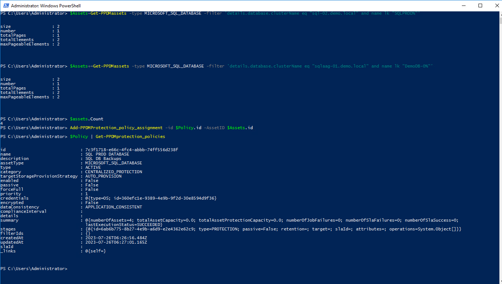
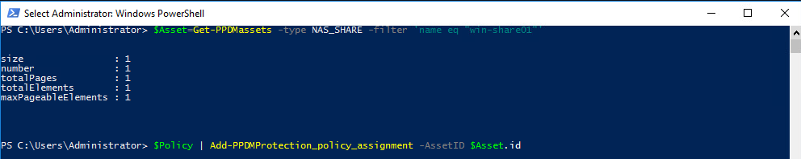
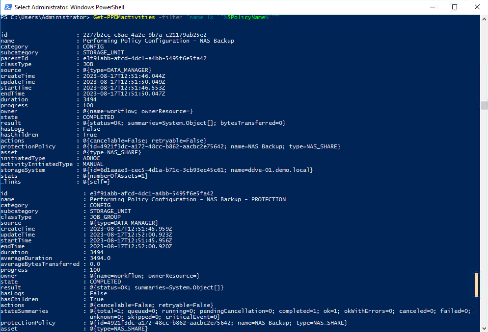
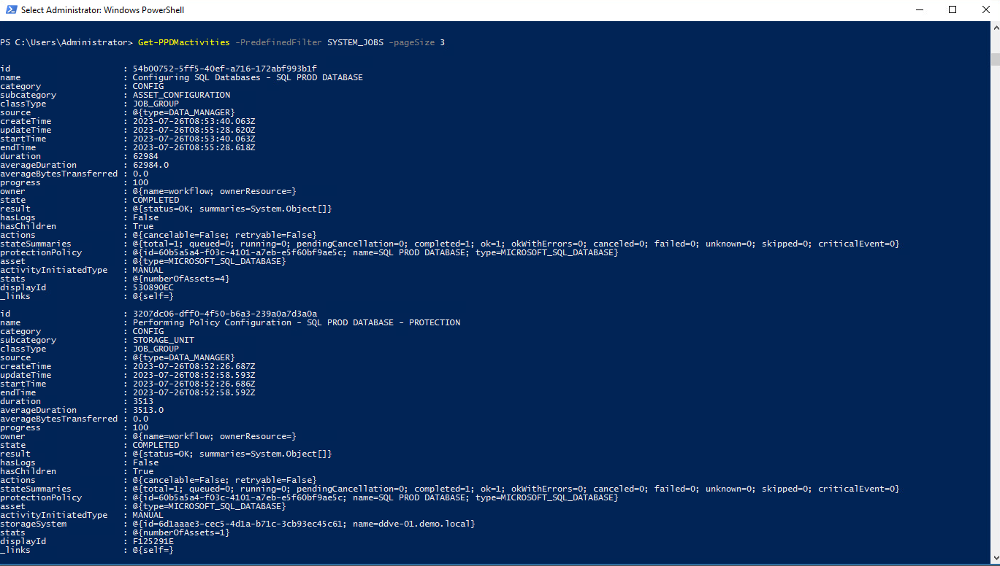
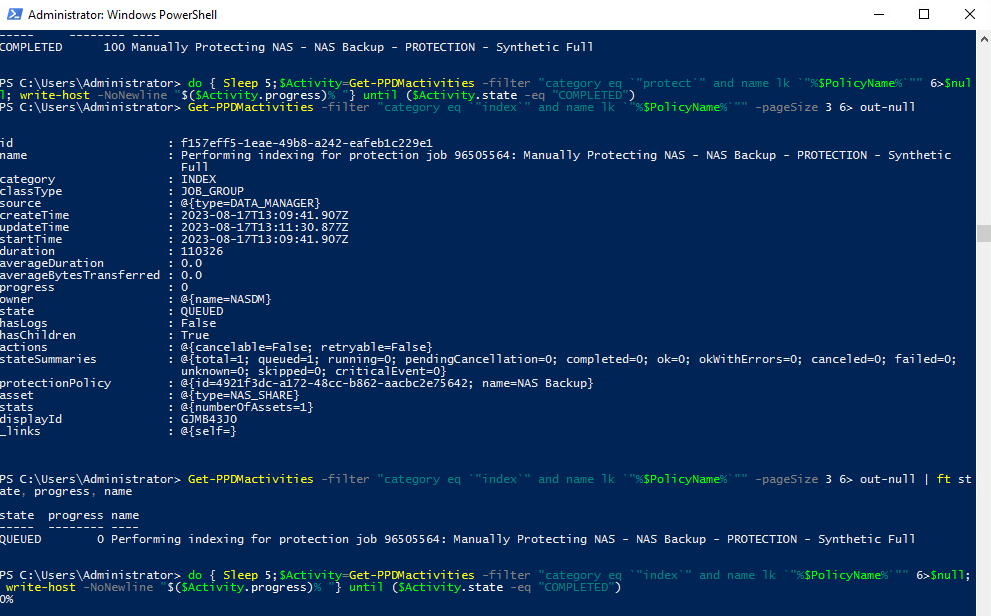

# MODULE 10 - DYNAMIC NAS PROTECTION

## LESSON 2 - PROTECT CIFS SHARE USING POWERPROTECT DATA MANAGER WITH INDEXING ENABLED

## Create a Protection Policy

## Create a Policy

We use a Helper Fuction *New-PPDMBackupSchedule* to Create a Stage0 Backup Schedule Object that we will use in the Protection Policy

>Recurrence: Hourly  
>Create Copy: 8 Hours  
>Keep For: 5 Days  
>Start Time: 08:00 PM  
>End Time: 06:00 AM  

```Powershell
$Schedule=New-PPDMBackupSchedule -hourly -CreateCopyIntervalHrs 8 -RetentionUnit DAY -RetentionInterval 5
```

In addition, we need to identify the StorageSystem to backup to.

```Powershell
$StorageSystem=Get-PPDMStorage_systems -Type DATA_DOMAIN_SYSTEM -Filter {name eq "ddve-01.demo.local"}
```

And also, we need the already existing Credentials:

$Creds=Get-PPDMcredentials -type nas -filter 'name eq"Isilon"'

Once we identified and created the Ressources aligned to the Policy, we create the Policy with

>Name: NAS Backup
>Description: Protect NAS Data
>Type: NAS  

```Powershell
$PolicyName="NAS Backup"
$PolicDescription="Protect NAS Data"
$Policy=New-PPDMNASBackupPolicy -Schedule $Schedule `
-Name $PolicyName `
-Description $PolicDescription `
-StorageSystemID $StorageSystem.id `
-indexingEnabled `
-enabled `
-NASCid $Creds.id `
-ContinueOn ACL_ACCESS_DENIED,DATA_ACCESS_DENIED
$Policy

```



## Assigning Assets top the Policy

Now we need to Assign the Asset(s) to the Protection Policy. Therefore, we filter an asset query to the Share win-share01:

```Powershell
$Asset=Get-PPDMassets -type NAS_SHARE -filter 'name eq "win-share01"'
```

Using the Policy Object from the Previously create Policy, we can run

```Powershell
$Policy | Add-PPDMProtection_policy_assignment -AssetID $Asset.id
```



## Monitoring the Activities

```Powershell
 Get-PPDMactivities -filter "name lk `"%$PolicyName%`"" 
```



## Start an AdHoc protection

There are Several ways to start a Protection Policy. For an AdHoc Protection, we would select  and individual AssetId and start the Protection with the given Stage0 defaults of the Policy.

```Powershell
Start-PPDMprotection -PolicyObject $Policy -AssetIDs $Asset.id
```

Monitor the Backups with:

```Powershell
Get-PPDMactivities -filter "category eq `"protect`" and name lk `"%$PolicyName%`"" -pageSize 3 6> out-null | ft state, progress, name
```

Or in a loop:

```Powershell
do { Sleep 5;$Activity=Get-PPDMactivities -filter "category eq `"protect`" and name lk `"%$PolicyName%`"" 6>$null; write-host -NoNewline "$($Activity.progress)% "} until ($Activity.state -eq "COMPLETED")
```



## Monitor Intexing

Indexing will start right after the Backup.
As with category protect, we can use the category indexing to Mounitor:  

```Powershell
Get-PPDMactivities -filter "category eq `"index`" and name lk `"%$PolicyName%`"" -pageSize 3 6> out-null
Get-PPDMactivities -filter "category eq `"index`" and name lk `"%$PolicyName%`"" -pageSize 3 6> out-null | ft state, progress, name
```

Or in a loop:

```Powershell
do { Sleep 5;$Activity=Get-PPDMactivities -filter "category eq `"index`" and name lk `"%$PolicyName%`"" 6>$null; write-host -NoNewline "$($Activity.progress)% "} until ($Activity.state -eq "COMPLETED")
```



[<<Module 10 Lesson 1](./Module_10_1.md) This Concludes Module 10 Lesson 2 [Module 10 Lesson 3 >>](./Module_10_3.md)
