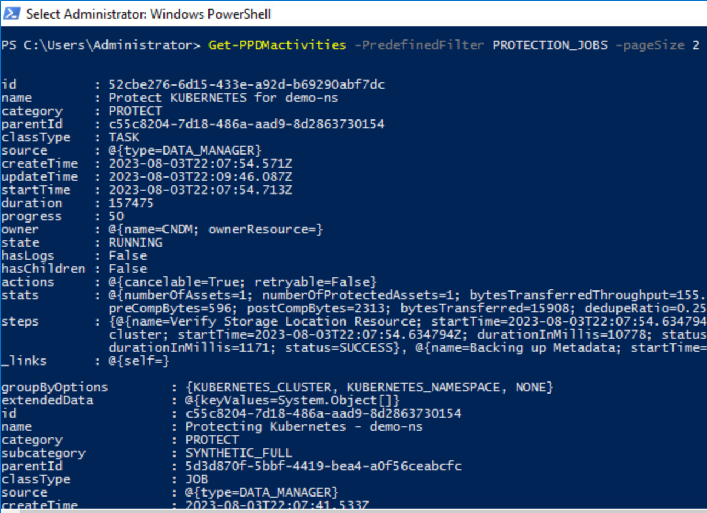
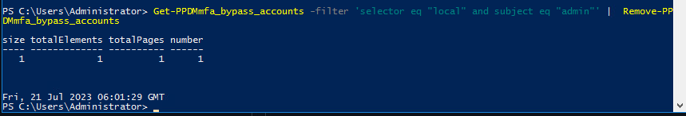
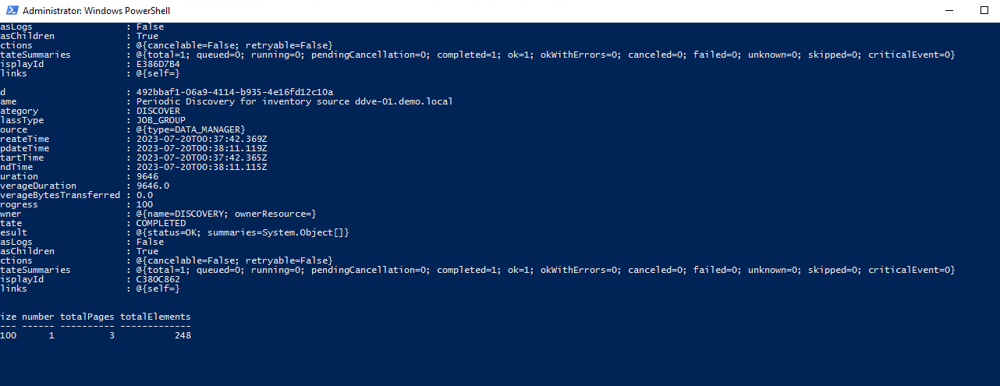
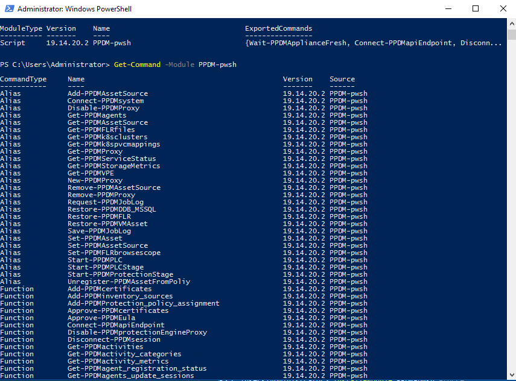

# MODULE 2 - MULTI FACTOR AUTHENTICATION USING RSA

## Verify RSA SecurID Configuration

```Powershell
Get-PPDMmfa_securids
```


Disable MFA

```Powershell
Get-PPDMmfa_securids | Set-PPDMmfa_securids -is_enabled:$false
```

At this Point, you cannot re-enable it as you will not have the token to access


## BYPASS MULTIFACTOR AUTHENTICATION

First, we need to get the IdentityProvider having the users we want to disable MFA for.
In Our Case it is the local Provider

```Powershell
Get-PPDMidentity_providers -type local
```


Check for any Bypassed (mfa disabled) user Account

```Powershell
Get-PPDMmfa_bypass_accounts
```


From above we can see that user admin is already bypassed. we van Remove the MFA Bypass using:

```Powershell
Get-PPDMmfa_bypass_accounts -filter 'selector eq "local" and subject eq "admin"' |  Remove-PPDMmfa_bypass_accounts
```



To disable MFA (Bypass) for a local user, we need to provide the accountname 

```Powershell
Get-PPDMidentity_providers -type local | Set-PPDMmfa_bypass_accounts -accountname admin
```


List the Account bypass for local user admin  

```Powershell
Get-PPDMmfa_bypass_accounts -filter 'selector eq "local" and subject eq "admin"'
```



 [<<Module 1](./Module_1.md) This Concludes Module 2


