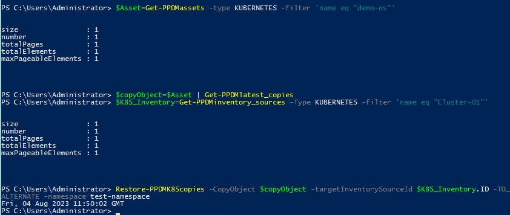

# MODULE 3 - PROTECT VMWARE VIRTUAL MACHINES - MODULE OVERVIEW

## LESSON 1 - DISCOVER VIRTUAL MACHINES

In this lesson we simulate adding of a vCenter in Powershell.  
As a vCenter i already preconfigured in the Environemnt, we can only look at the existing and change some settings

```Powershell
Get-PPDMinventory_sources -Type VCENTER -filter 'address eq "vcsa-7.demo.local"'
```

You should see the vCenter configuration now:


The Normal Process of onboarding a vCenter from Powershell would be

- Creating a vCenter Credential in PPDM
- Approving the Certificate
- Adding the vCenter

To Create new vCenter Credntials in ppdm, run the command

```Powershell
$CREDS=New-PPDMcredentials -type VCENTER -name testcreds
```

with the Credentials <administrator@vsphere.local> / Password123!


To approve tghe Certificate ( also good for refreshing Certs) use the following Powershell Code

```Powershell
Get-PPDMcertificates -newhost vcsa-7.demo.local -port 443 | Approve-PPDMcertificates
```

