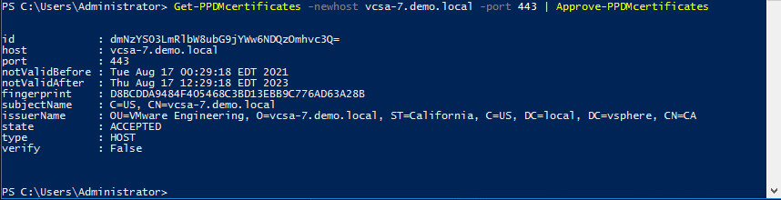
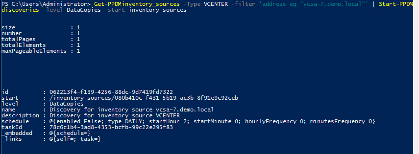
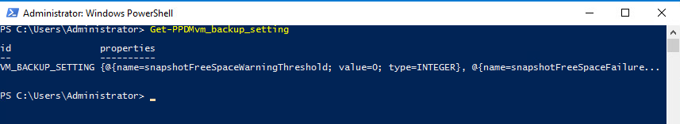
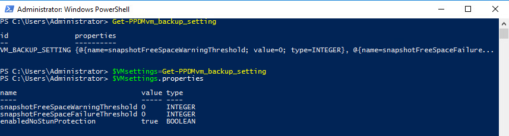

# MODULE 3 - PROTECT VMWARE VIRTUAL MACHINES 

## LESSON 1 - DISCOVER VIRTUAL MACHINES

In this lesson we simulate adding of a vCenter in Powershell.  
As a vCenter is already preconfigured in the Environemnt, we can only look at the existing and change some settings

### Get an existing vCenter Asset source

```Powershell
Get-PPDMinventory_sources -Type VCENTER -filter 'address eq "vcsa-7.demo.local"'
```

You should see the vCenter configuration now:


### The Normal Process of onboarding a vCenter from Powershell would be

- Creating a vCenter Credential in PPDM
- Approving the Certificate
- Adding the vCenter

To Add  new vCenter Credntials in ppdm, run the command

```Powershell
$CREDS=New-PPDMcredentials -type VCENTER -name testcreds
$CREDS
```

with the Credentials <admin@vsphere.local> / Password123!

To approve tghe Certificate ( also good for refreshing Certs) use the following Powershell Code

```Powershell
Get-PPDMcertificates -newhost vcsa-7.demo.local -port 443 | Approve-PPDMcertificates
```



Now we  would be ready to add the new vCenter

```Powershell
Add-PPDMinventory_sources -Hostname vcsa-7.demo.local -port 443 -Type VCENTER -isHostingvCenter -ID $CREDS.id -Name "DEMO VCENTER"
```

This command is expected to fail as the Inventory already exists


### INCREMENTAL DISCOVERY

Start an icremental discovery using the function *Start-PPDMdiscoveries*

```Powershell
Get-PPDMinventory_sources -Type VCENTER -filter 'address eq "vcsa-7.demo.local"' | Start-PPDMdiscoveries -level DataCopies -start inventory-sources
```



With the Knowledge from Module 1, we can now review the discovery activity:

```Powershell
# Replace your Discovery ID here
Get-PPDMactivities -id 1ff60683-41e4-4389-8db7-38a549bc8ba4 
```


### SET THRESHOLD LIMITS

Get the VM Backup Threshold Settings 

```Powershell
Get-PPDMvm_backup_setting
```



Review the Properties before we chage:

```Powershell
$VMsettings=Get-PPDMvm_backup_setting
$VMsettings.properties
```


Adjust the Values and review

```Powershell
$VMsettings.properties[0].value=10
$VMsettings.properties[1].value=5
$VMsettings.properties
```


Apply the Settings

```Powershell
Set-PPDMvm_backup_setting -vm_backup_setting $VMsettings
```


[TLDR](./scripts/Module_3_1.ps1)

 [<<Module 2](./Module_2.md) This Concludes Module 3 Lesson 1 [Module 3 Lesson 2 >>](./Module_3_2.md)
