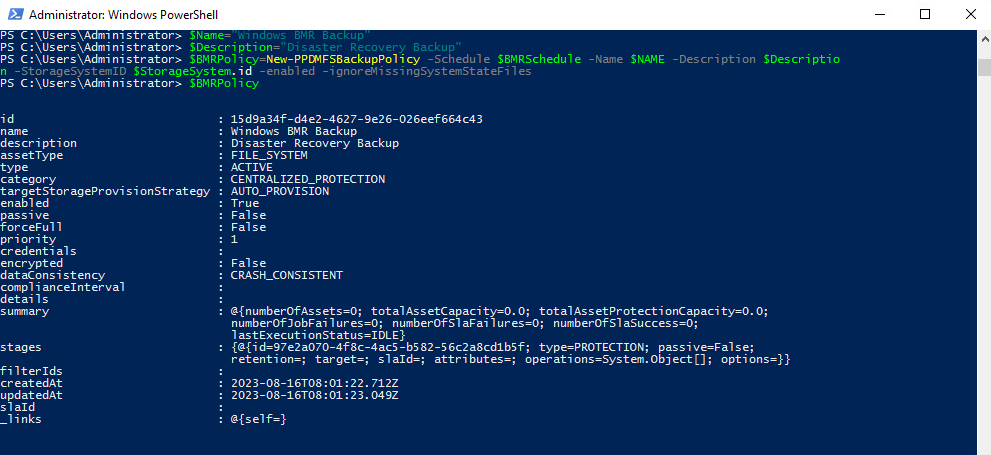
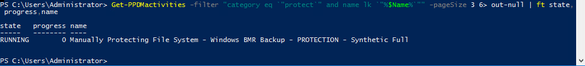
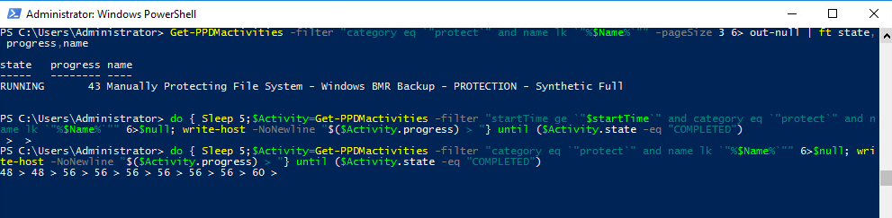
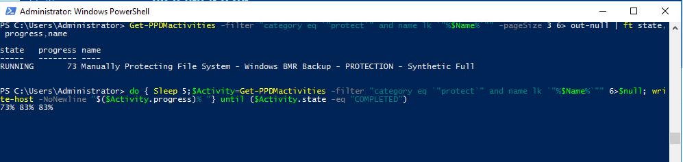
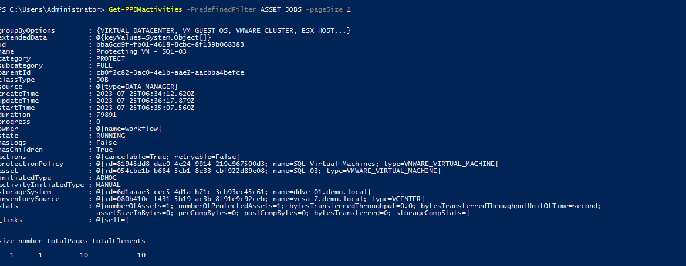

# MODULE 3 - PROTECT VMWARE VIRTUAL MACHINES

## LESSON 3 - PROTECT SQL VIRTUAL MACHINES USING PRE-CREATED/EXISTING STORAGE UNIT(APPLICATION AWARE)

In this Lesson we Create a Protectin Policy for Oracle Centralized Protection
We alo need to create the following Credentials:

>Credential Name: oracle
>User Name: oracle
>Password: Password123!
Thie time we will pass a credentials string to Powershell

```Powershell
$username="oracle"
$credentialname="oracle
$assword="Password123!"
$Securestring=ConvertTo-SecureString -AsPlainText -String $Password -Force
$Credentials = New-Object System.Management.Automation.PSCredential($username, $Securestring)
$Credentials=New-PPDMcredentials -type OS -name $credentialname -authmethod BASIC 
```

Again, we read our Storage System

```Powershell
$StorageSystem=Get-PPDMStorage_systems -Type DATA_DOMAIN_SYSTEM -Filter {name eq "ddve-01.demo.local"}
```

Next, we need to create a Database Backup Schedule:

>Recurrence: Hourly  
>Create Copy: 8 Hours  
>Keep for: 5 days  
>Start Time: 8 PM  
>End Time: 6 AM  

```Powershell
$DBSchedule=New-PPDMDatabaseBackupSchedule -hourly -CreateCopyIntervalHrs 8 -RetentionUnit DAY -RetentionInterval 5 -starttime 8:00PM -endtime 6:00AM
```

Finally, we create a Policy

>Name: SQL Virtual Machines  
>Description: App Aware Policy  
>Type: Virtual Machine  

```Powershell
New-PPDMSQLBackupPolicy -Schedule $DBSchedule -Name "SQL Virtual Machines" -Description "SQL Virtual Machines"  -AppAware -dbCID $Credentials.id -StorageSystemID $StorageSystem.id -DataMover SDM -SizeSegmentation VSS
```


Now we need to Assign the Database VM Asset(s) to the Protection Policy. Therefore, we filter an asset query to the VM LINUX-01:

```Powershell
$Asset=Get-PPDMassets -type VMWARE_VIRTUAL_MACHINE -filter 'name eq "SQL-03"'
```

Copying the Policy Id from the Previously create Policy, we can run

```Powershell
Add-PPDMProtection_policy_assignment -AssetID $Asset.id -ID <your Policy ID>
```

View the Running Jobs

```Powershell
Get-PPDMactivities -PredefinedFilter ASSET_JOBS -pagesize 2
```



```Powershell
Get-PPDMactivities -PredefinedFilter SYSTEM_JOBS -pageSize 2
```



```Powershell
Get-PPDMactivities -PredefinedFilter PROTECTION_JOBS -pageSize 2
```



Finally, we start the Protection Policy:

```Powershell
Start-PPDMprotection_policies -id <your Policy ID> -BackupType FULL -RetentionUnit DAY -RetentionInterval 2
```

View the Latest Asset Jobs

```Powershell
Get-PPDMactivities -PredefinedFilter ASSET_JOBS -pageSize 1
```





 [<<Module 3 Lesson 2](./Module_3_2.md) This Concludes Module 3 Lesson 3 [Module 3 Lesson 4 >>](./Module_3_4.md)