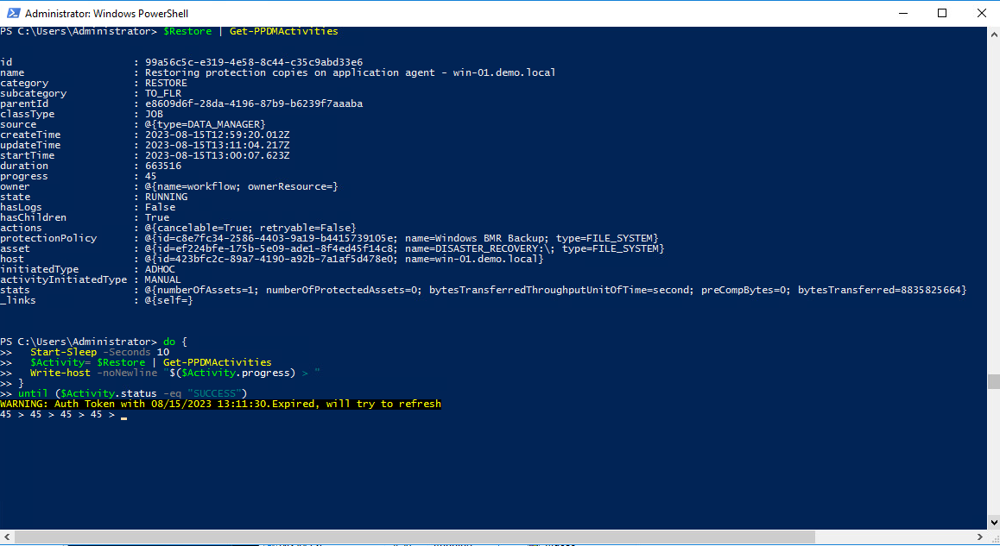
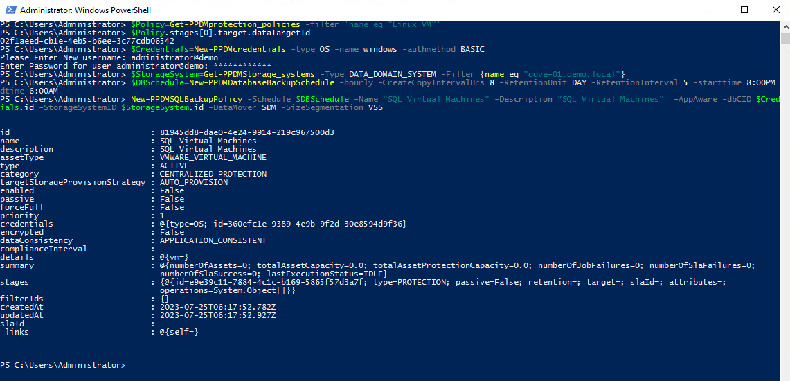

# MODULE 3 - PROTECT VMWARE VIRTUAL MACHINES

## LESSON 3 - PROTECT SQL VIRTUAL MACHINES USING PRE-CREATED/EXISTING STORAGE UNIT(APPLICATION AWARE)

As we will re-use the StorageUnit (also refreed to as DataTarget) from Lesson 2, we read the Plolicy Properties with

```Powershell
$Policy=Get-PPDMprotection_policies -filter 'name eq "Linux VM"'
```

The DataTarget is stored in *$Policy.stages[0].target.dataTargetId*

```Powershell
$Policy.stages[0].target.dataTargetId
```

We also need to create the following Credetials:

>Credential Name: windows
>User Name: administrator@demo
>Password: Password123!

```Powershell
$Credentials=New-PPDMcredentials -type OS -name windows -authmethod BASIC 
```

Again, we read our Storage System

```Powershell
$StorageSystem=Get-PPDMStorage_systems -Type DATA_DOMAIN_SYSTEM -Filter {name eq "ddve-01.demo.local"}
```

Next, we need to create a Database Backup Schedule:

>Recurrence: Hourly  
>Create Copy: 8 Hours  
>Keep for: 5 days  
>Start Time: 8 PM  
>End Time: 6 AM  

```Powershell
$DBSchedule=New-PPDMDatabaseBackupSchedule -hourly -CreateCopyIntervalHrs 8 -RetentionUnit DAY -RetentionInterval 5 -starttime 8:00PM -endtime 6:00AM
```

Finally, we create a Policy

>Name: SQL Virtual Machines  
>Description: App Aware Policy  
>Type: Virtual Machine  

```Powershell
New-PPDMSQLBackupPolicy -Schedule $DBSchedule -Name "SQL Virtual Machines" -Description "SQL Virtual Machines"  -AppAware -dbCID $Credentials.id -StorageSystemID $StorageSystem.id -DataMover SDM -SizeSegmentation VSS
```



Now we need to Assign the Database VM Asset(s) to the Protection Policy. Therefore, we filter an asset query to the VM LINUX-01:

```Powershell
$Asset=Get-PPDMassets -type VMWARE_VIRTUAL_MACHINE -filter 'name eq "SQL-03"'
```

Copying the Policy Id from the Previously create Policy, we can run

```Powershell
Add-PPDMProtection_policy_assignment -AssetID $Asset.id -ID <your Policy ID>
```