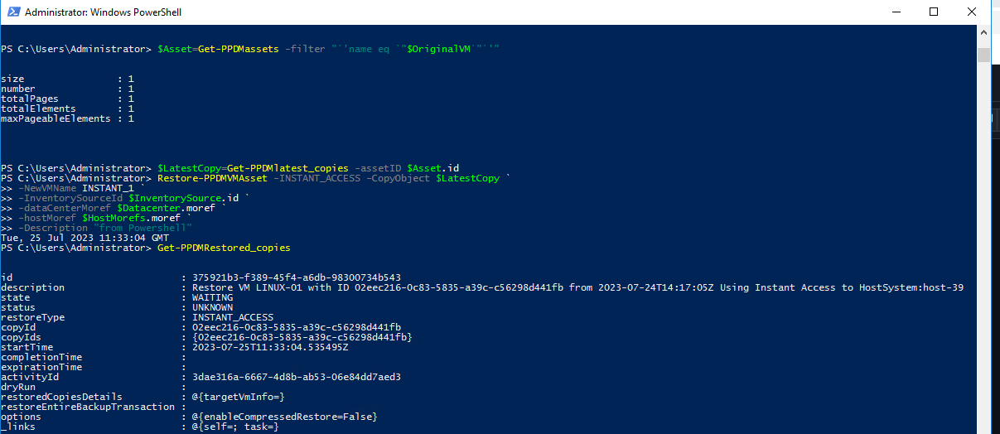

# MODULE 3 - PROTECT VMWARE VIRTUAL MACHINES

## LESSON 5 - CENTRALIZED INSTANT ACCESS RESTORE OF VM ASSET

Doing Instant Access Restores in a vMware Environemnt requires us to use Managed Object References (Moref´s)
First, we set somw Variables for the Environmen:

```Powershell
$vcenterName="vcsa-7.demo.local"
$RestoreHost="esxi03-7.demo.local"
$OriginalVM="LINUX-01"
```

Next, we read out the Target Datacenter Inventory Source

```Powershell
$InventorySource=Get-PPDMinventory_sources -Type VCENTER -filter "`'address eq `"$vcenterName`"`'"
```

Read the Datacenter Moref

```Powershell
$Datacenter=$InventorySource| Get-PPDMvcenterDatacenters
$Datacenter
```


Get Information on the ESX Host we want to restore

```Powershell
$ESXHOST=Get-PPDMhosts -type ESX_HOST -filter "`'name eq `"$RestoreHost`"`'"
```

Get the Moref´s of the Host

```Powershell
$HostMorefs=Get-PPDMvcenterMorefs -ID $InventorySource.ID -hostMoref $ESXHOST.details.esxHost.hostMoref
$HostMorefs
```


Read the Original Asset

```Powershell
$Asset=Get-PPDMassets -filter "`'name eq `"$OriginalVM`"`'"
```

Get the latest Copy for the Asset

```Powershell
$LatestCopy=Get-PPDMlatest_copies -assetID $Asset.id
```

And finally run the Restore

```Powershell
$Restore=Restore-PPDMVMAsset -INSTANT_ACCESS -CopyObject $LatestCopy `
-NewVMName INSTANT_1 `
-InventorySourceId $InventorySource.id `
-dataCenterMoref $Datacenter.moref `
-hostMoref $HostMorefs.moref `
-Description "from Powershell"
Get-PPDMRestoredCopies
```



Now See the Status of the Instant Access Sewssion

```Powershell
$Restore | Get-PPDMRestoredCopies
```


[TLDR](./scripts/Module_3_5.ps1)

[<<Module 3 Lesson 4](./Module_3_4.md) This Concludes Module 3 [Module 4 Lesson 1>>](./Module_4_1.md)
