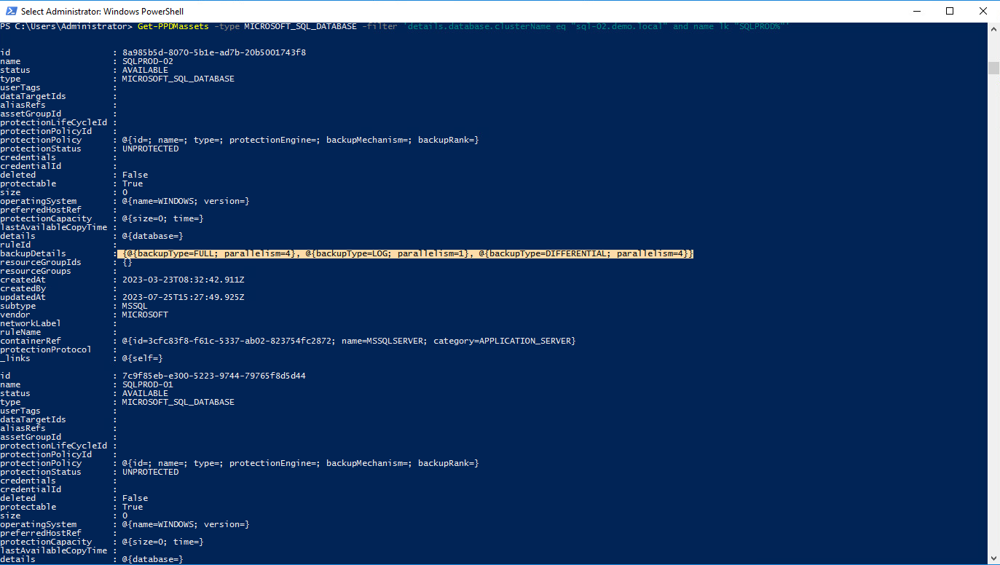
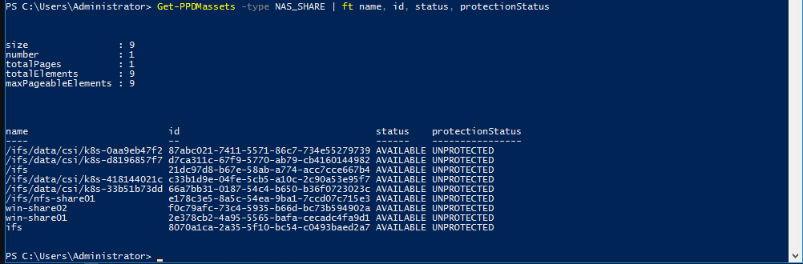
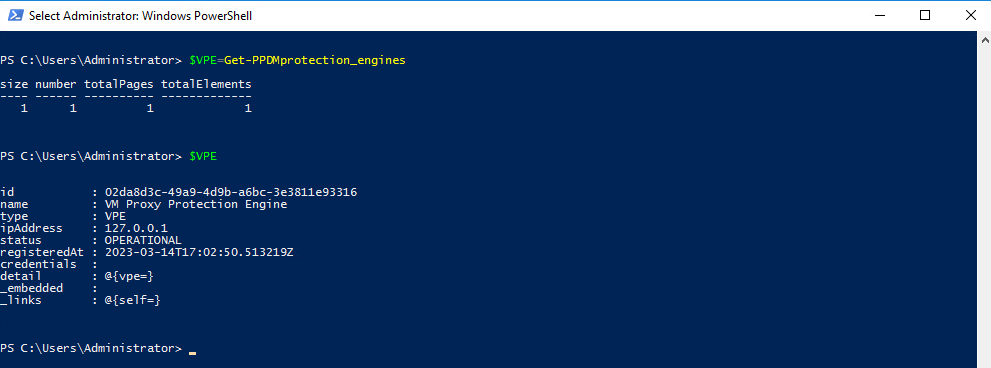

# MODULE 4 - PROTECT SQL DATABASES

## LESSON 1 - DISCOVER SQL DATABASES

Review the Agent Regitration Status.

```Powershell
Get-PPDMagent_registration_status
```

The Command will output all Agents Registrations


Agents cann be approved via the *Set-PPDMWhitelist* Function, eiter from ID or from Pipeline

```Powershell
Get-PPDMWhitelist | Set-PPDMWhitelist -state APPROVED
```


Lets start a discover for host *sql-02.demo.local*

```Powershell
Get-PPDMhosts -filter 'name eq"sql-02.demo.local"' | Start-PPDMdiscoveries -level HOSTFULL -start hosts
```


```Powershell
Get-PPDMactivities -taskid <Use TaskID from you discover to check the activity>
```


Now lets have a look at the Discovered Databases

```Powershell
Get-PPDMassets -type MICROSOFT_SQL_DATABASE -filter 'details.database.clusterName eq "sql-02.demo.local"' | ft
```



As we can see, Stream Counts are set to 4 for Full and Differential, and to 1 for logs.  
We change this with

```Powershell
Get-PPDMassets -type MICROSOFT_SQL_DATABASE -filter 'details.database.clusterName eq "sql-02.demo.local" and name lk "SQLPROD%"' | Set-PPDMMSSQLassetStreamcount -LogStreamCount 10 -FullStreamCount 10 -DifferentialStreamCount 10
```

```Powershell
(Get-PPDMassets -type MICROSOFT_SQL_DATABASE -filter 'details.database.clusterName eq "sql-02.demo.local" and name lk "SQLPROD%"').backupDetails
```



```Powershell
$Schedule=New-PPDMDatabaseBackupSchedule -hourly -CreateCopyIntervalHrs 1 -DifferentialBackupUnit MINUTELY -DifferentialBackupInterval 30 -RetentionUnit DAY -RetentionInterval 5
```

```Powershell
$StorageSystem=Get-PPDMStorage_systems -Type DATA_DOMAIN_SYSTEM -Filter {name eq "ddve-01.demo.local"}

```

```Powershell
New-PPDMSQLBackupPolicy -Schedule $Schedule -Name "SQL PROD DATABASE"  -dbCID $credentials.id -StorageSystemID $StorageSystem.id
```




For output reasons we did not assign the result of the command  to a Variable. But we an leverage the filter api do do so. We Always use Filters to query for Human Readable Entities, otherwise we would select by id:

```Powershell
$Policy=Get-PPDMprotection_policies -filter 'name eq "SQL PROD DATABASE"'
```

Lets to the same with the SQL Assets we are going to assign to the Policy:

```Powershell
$Assets=Get-PPDMassets -type MICROSOFT_SQL_DATABASE -filter 'details.database.clusterName eq "sql-02.demo.local" and name lk "SQLPROD%"'
```

Add-PPDMProtection_policy_assignment -AssetID $Assets.id -ID $Policy.ID

