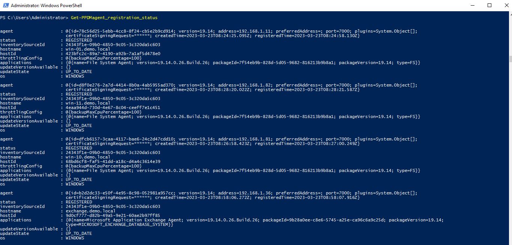
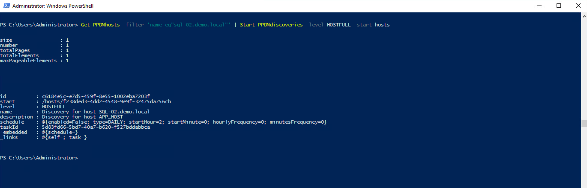
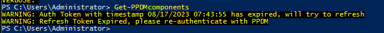

# MODULE 4 - PROTECT SQL DATABASES

## LESSON 1 - DISCOVER SQL DATABASES

Review the Agent Regitration Status.

```Powershell
Get-PPDMagent_registration_status
```

The Command will output all Agents Registrations



Agents cann be approved via the *Set-PPDMWhitelist* Function, eiter from ID or from Pipeline

```Powershell
Get-PPDMWhitelist | Set-PPDMWhitelist -state APPROVED
```


Lets start a discover for host *sql-02.demo.local*

```Powershell
Get-PPDMhosts -filter 'name eq"sql-02.demo.local"' | Start-PPDMdiscoveries -level HOSTFULL -start hosts
```



```Powershell
Get-PPDMactivities -taskid <Use TaskID from you discover to check the activity>
```

Now lets have a look at the Discobvered Databases



```Powershell

```