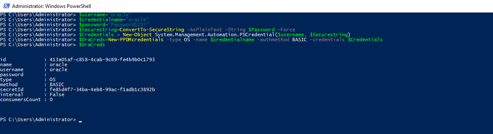
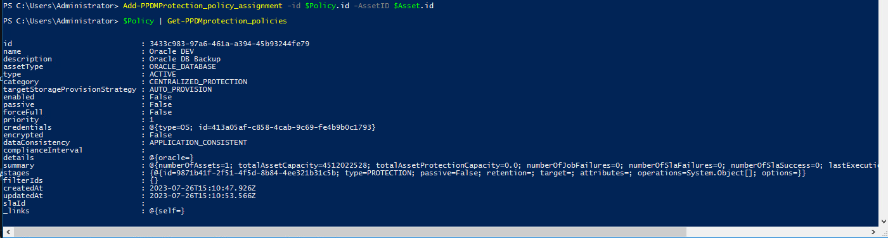

# MODULE 5 - PROTECT & RESTORE ORACLE DATABASE FROM POWERSHELL

## LESSON 1 - PROTECT ORACLE DATABASES

In this Lesson we Create a Protectin Policy for Oracle Centralized Protection
We alo need to create the following Credentials:

>Credential Name: oracle  
>User Name: oracle  
>Password: Password123!  

This time we will pass a credentials string to the *New-PPDMcredentials*

```Powershell
$username="oracle"
$credentialname="oracle"
$password="Password123!"
$Securestring=ConvertTo-SecureString -AsPlainText -String $Password -Force
$Credentials = New-Object System.Management.Automation.PSCredential($username, $Securestring)
$OraCreds=New-PPDMcredentials -type OS -name $credentialname -authmethod BASIC -credentials $Credentials
$OraCreds
```



## Storage System

Again, we read our Storage System

```Powershell
$StorageSystem=Get-PPDMStorage_systems -Type DATA_DOMAIN_SYSTEM -Filter {name eq "ddve-01.demo.local"}
```

## Creating a Database Schedule

The following Backup Schedule is required:
Full:  
>Recurrence: Hourly  
>Keep for: 5 Days  
>Start Time: 8:00 PM  
>End Time: 6:00 AM  
Log:  
>Recurrence : 15 minutes  
>Start: 08:00 PM  
>End: 06:00 AM  

```Powershell
$OraSchedule=New-PPDMDatabaseBackupSchedule -hourly -CreateCopyIntervalHrs 1 -RetentionUnit DAY -RetentionInterval 5 -starttime 8:00PM -endtime 6:00AM -LogBackupUnit MINUTELY -LogBackupInterval 15
```

## Creating the Protection Policy

>Name:  Oracle DEV  
>Description: Oracle DB Backup  

```Powershell
$Policy=New-PPDMOracleBackupPolicy -Schedule $OraSchedule -Name "Oracle DEV" -Description "Oracle DB Backup" -dbCID $OraCreds.id -StorageSystemID $StorageSystem.id
```


## Assign an Asset
First, find the Asset

>DatabaseName: oracl

```Powershell
$Asset=Get-PPDMassets -type ORACLE_DATABASE -filter 'details.database.clusterName eq "oracle01.demo.local" and name eq "orcl"'
$Asset
```


Then, Assign the Asset to the Poliocy

```Powershell
Add-PPDMProtection_policy_assignment -id $Policy.id -AssetID $Asset.id
$Policy | Get-PPDMprotection_policies
```



Watch the Activities

```Powershell
Get-PPDMactivities -PredefinedFilter PROTECTION_JOBS -pageSize 2
```


[<<Module 4 Lesson 1](./Module_4_1.md) This Concludes Module 4 Lesson 2 [Module 5 Lesson 1>>](./Module_5_1.md)

