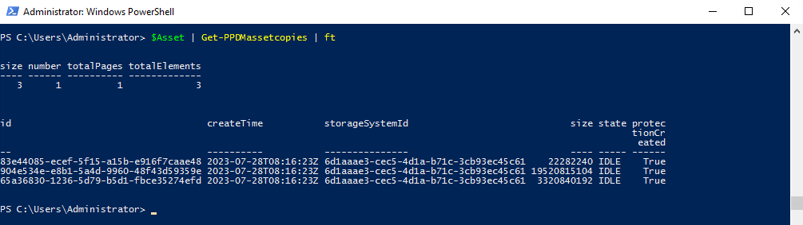
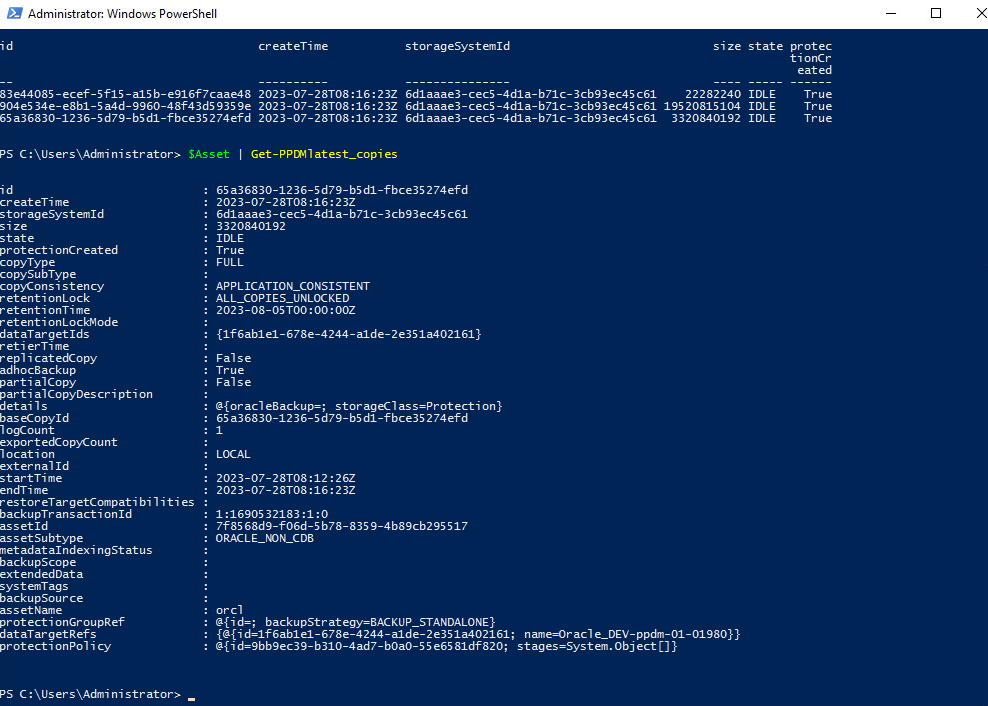

# MODULE 5 - PROTECT & RESTORE ORACLE DATABASE FROM POWERSHELL

## LESSON 2 - VIEW ORACLE COPIES

In this lesson, we will learn how to view and manage Oracle copies on the Protection Storage, including extending the retention period of an existing backup.

## Identify our Asset

>DatabaseName: oracl

```Powershell
$Asset=Get-PPDMassets -type ORACLE_DATABASE -filter 'name eq "orcl"'
$Asset
# Note you can also add the Server name if you have multiple DB Assets with te same Name...
# $Asset=Get-PPDMassets -type ORACLE_DATABASE -filter 'details.database.clusterName eq "oracle01.demo.local" and name eq "orcl"'
```


## Get your Asset Copies

To get all Copies of an asset, or use custom filters, use *Get-PPDMassetcopies*

```Powershell
$Asset | Get-PPDMassetcopies | ft
```



For the latest copy of an asset, use

```Powershell
$Asset | Get-PPDMlatest_copies
```



[TLDR](./scripts/Module_5_2.ps1)

[<<Module 5 Lesson 1](./Module_5_1.md) This Concludes Module 5 Lesson 2 [Module 5 Lesson 3>>](./Module_5_3.md)
