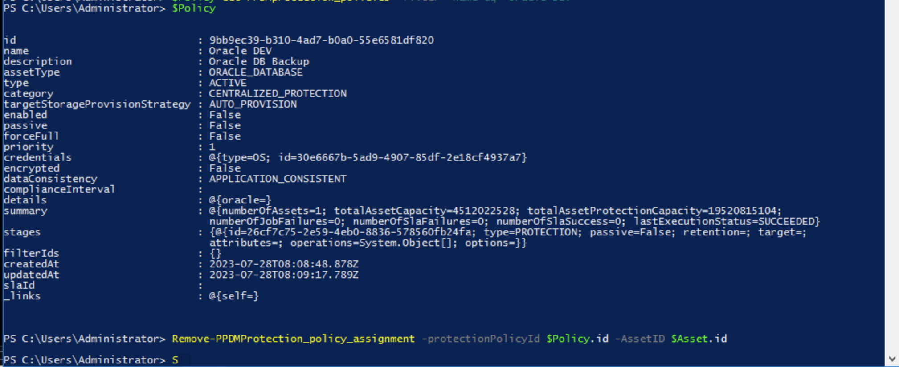

# MODULE 5 - PROTECT & RESTORE ORACLE DATABASE FROM POWERSHELL

## LESSON 4 - PROTECT ORACLE DATABASES USING ORACLE INCREMENTAL MERGE

In this lesson we are going to protect Oracle Database using the new Oracle Incremental Feature.
Pre-requirement for this feature would be boostfs to be installed on the oracle server manually 

## Removing the Oracle Asset from the Previous Policy

As we are moving the Asset to an Incremental Merge Policy, we first need to unassign the Asset from the previous Policy.

If you still in the Same Powershell Session fro. Previous lesson, you already have the Policy as $Policy and the Oracel Asset as $Asset

If not, do

```Powershell

$Asset=Get-PPDMassets -type ORACLE_DATABASE -filter 'details.database.clusterName eq "oracle01.demo.local" and name eq "orcl"'
$Policy=Get-PPDMprotection_policies -filter 'name eq "Oracle DEV"'
```


Remove the Asset using
```Powershell
Remove-PPDMProtection_policy_assignment -protectionPolicyId $Policy.id -AssetID $Asset.id
```


## Creating a new Oracle Incremental merge Policy

Now we are going to create a new Oracle Incremental Merge Policy using the following Parameters

>Name:  Oracle Backup OIM
>Description: Oracle Backup - OIM
>Type: Oracle  & then Select - Oracle Incremental Merge Backup


## Creating a Oracle Incremental Merge Policy

First we start with creating a new Schedule for the Policy

```Powershell
$OIMSchedule=New-PPDMDatabaseBackupSchedule -hourly -CreateCopyIntervalHrs 1 -RetentionUnit DAY -RetentionInterval 5
```

Next, we create a OIM Policy
```Powershell
$OIMPolicy=New-PPDMOracleBackupPolicy -Schedule $OraSchedule -Name "Oracle Backup OIM" -Description "Oracle Backup - OIM" -dbCID $OraCreds.id -StorageSystemID $StorageSystem.id
```