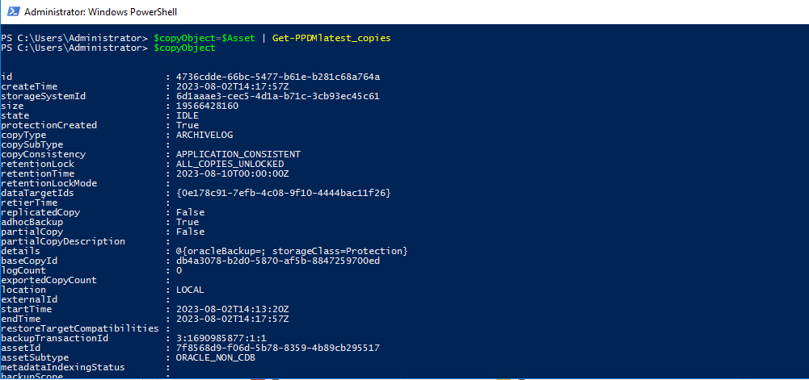

# MODULE 5 - PROTECT & RESTORE ORACLE DATABASE FROM POWERSHELL

## LESSON 5 - PERFORM INSTANT RECOVERY USING OIM BACKUP COPY

## IMPORTANT ! FOLLLOW THE LAB GUIDE TO PREPARE THE  ORACLE Server:

As we are reusing the Production server, we have to Shutdown the Database and remove it from the OraTab:


- click on the Royal TS icon located on the Desktop
- Connect to oracle01.demo.local
- Double-click on oracle01 to connect to oracle01.demo.local
- 'su - oracle' to switch to oracle use wirh Password123!
- 'sqlplus "/as sysdba" and wait for the SQL> prompt
- select status from v$instance;
- shutdown immediate;
- vi /etc/oratab
   comment the entry : # orcl:/opt/oracle/product/18c/dbhomeXE:Y

## Identify our Asset

>DatabaseName: orcl

```Powershell
$Asset=Get-PPDMassets -type ORACLE_DATABASE -filter 'name eq "orcl"'
$Asset
# Note you can also add the Server name if you have multiple DB Assets with te same Name...
# $Asset=Get-PPDMassets -type ORACLE_DATABASE -filter 'details.database.clusterName eq "oracle01.demo.local" and name eq "orcl"'
```


## Credentials

we will need the oracle Credenitials from [Lesson 5.1](https://github.com/dell-democenter/dell-democenter.github.io/blob/main/Module_5_1.md#)
If you fva enot done, follow te instructions to create [Create Oracle Credentials](https://github.com/dell-democenter/dell-democenter.github.io/blob/main/Module_5_1.md#creating-the-credential)

If you have created the Credentials but the are not scoped to a Variable, do

```Powershell
$OraCreds=Get-PPDMcredentials -filter 'name eq "oracle"'
```

## Get your Asset Copies

To get all Copies of an asset, or use custom filters, use *Get-PPDMassetcopies*

```Powershell
$Asset | Get-PPDMassetcopies | ft
```


## For the latest copy of an asset, use

```Powershell
$copyObject=$Asset | Get-PPDMlatest_copies
```



## We need to read our Oracle Host

```Powershell
$OraHost=Get-PPDMhosts -type APP_HOST -filter 'name eq "oracle01.demo.local"'
```

## Run the Restore

```Powershell
$Parameter = @{
    'copyobject'            = $CopyObject 
    'appServerID'           = $Asset.details.database.appServerId 
    'HostID'                = $OraHost.id
    'crossCheckBackup'      = $true
    'OraCredObject'         = $OraCreds
    'targetSid'             = "orcl"
    'targetInstallLocation' = "/opt/oracle/product/18c/dbhomeXE"
}
```

```Powershell
Restore-PPDMOracle_OIM_copies @Parameter
```


## Get the Status of the Activity from Restore

```Powershell
Get-PPDMactivities -PredefinedFilter PROTECTION_JOBS -pageSize 5
```

Once you identified you activity, do

```Powershell
(Get-PPDMactivities -ID <your activity id> ).steps
```


you may want to repeat the Command or create a loop that monitors the activities
( will be handled in an Advanced Session later)

[<<Module 5 Lesson 4](./Module_5_4.md) This Concludes Module 5 Lesson 5 [Module 5 Lesson 3>>](./Module_5_3.md)

