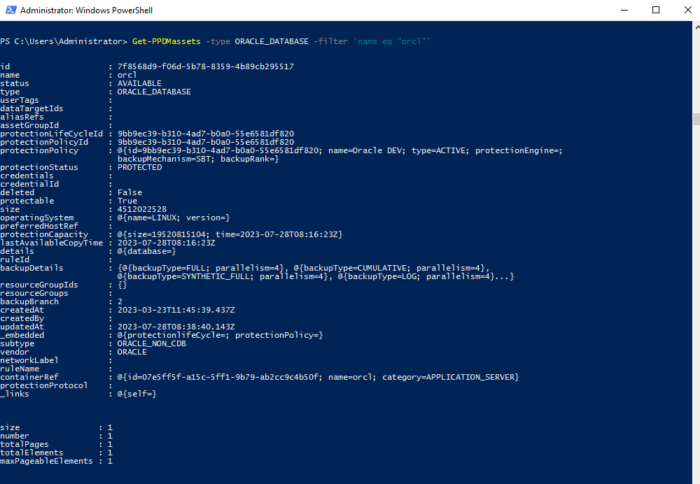
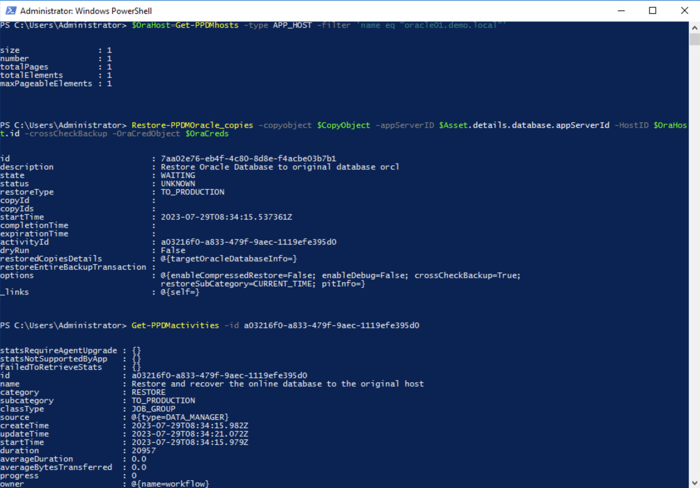

# MODULE 5 - PROTECT & RESTORE ORACLE DATABASE FROM POWERSHELL

## LESSON 5 - PERFORM INSTANT RECOVERY USING OIM BACKUP COPY


## IMPORTANT FOLLLOW THE LAB GUIDE TO PREPARE THE  ORACLE Server:

- click on the Royal TS icon located on the Desktop
- Connect to oracle01.demo.local
- Double-click on oracle01 to connect to oracle01.demo.local
- 'su - oracle' to switch to oracle use wirh Password123!
- 'sqlplus "/as sysdba" and wait for the SQL> prompt
- select status from v$instance;
- shutdown immediate;
- startup nomount;


## Identify our Asset

>DatabaseName: oracl

```Powershell
$Asset=Get-PPDMassets -type ORACLE_DATABASE -filter 'name eq "orcl"'
$Asset
# Note you can also add the Server name if you have multiple DB Assets with te same Name...
# $Asset=Get-PPDMassets -type ORACLE_DATABASE -filter 'details.database.clusterName eq "oracle01.demo.local" and name eq "orcl"'
```



## Get your Asset Copies

To get all Copies of an asset, or use custom filters, use *Get-PPDMassetcopies*

```Powershell
$Asset | Get-PPDMassetcopies | ft
```


## For the latest copy of an asset, use

```Powershell
$copyObject=$Asset | Get-PPDMlatest_copies
```


## We need to read our Oracle Host

```Powershell
$OraHost=Get-PPDMhosts -type APP_HOST -filter 'name eq "oracle01.demo.local"'
```

## Run the Restore

```Powershell
$Parameter = @{
    'copyobject'            = $CopyObject 
    'appServerID'           = $Asset.details.database.appServerId 
    'HostID'                = $OraHost.id
    'crossCheckBackup'      = $true
    'OraCredObject'         = $OraCreds
    'targetSid'             = "oracl"
    'targetInstallLocation' = "/opt/oracle/product/18c/dbhomeXE"
    'Verbose'               = $true
    'noop'                  = $true
}
```

```Powershell
Restore-PPDMOracle_OIM_copies @Parameter
```

## run the restore

```Powershell
Restore-PPDMOracle_copies -copyobject $CopyObject -appServerID $Asset.details.database.appServerId -HostID $OraHost.id -crossCheckBackup -OraCredObject $OraCreds
```

## Get the Status of the Activity from Restore

```Powershell
Get-PPDMactivities -id a03216f0-a833-479f-9aec-1119efe395d0
```



you may want to repeat the Command or create a loop that monitors the activities
( will be handled in an Advanced Session later)

```Powershell
Get-PPDMactivities -id a03216f0-a833-479f-9aec-1119efe395d0
```


[<<Module 5 Lesson 2](./Module_5_2.md) This Concludes Module 5 Lesson 3 [Module 5 Lesson 3>>](./Module_5_3.md)

>>>>>>> de69ba329bbea4e999dd22e58608502c9622e155