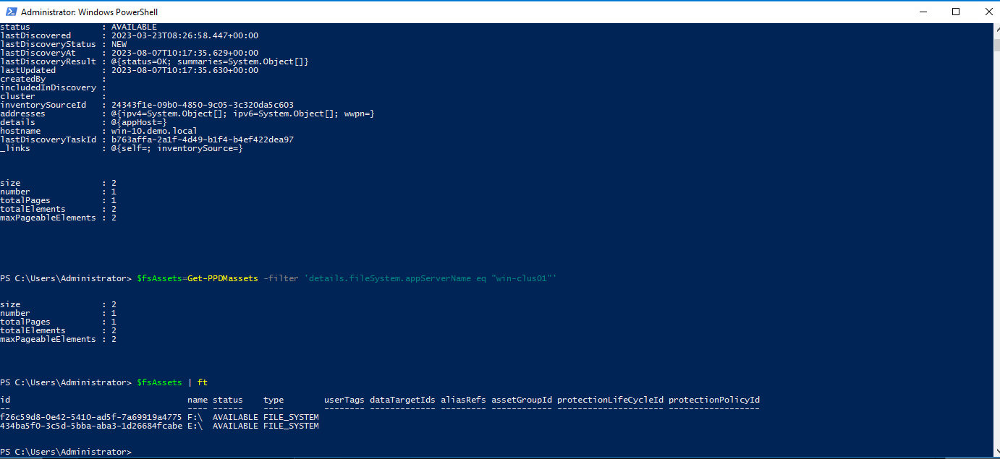
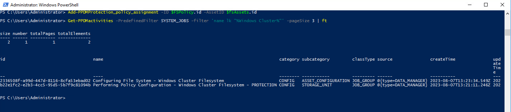

# MODULE 8 - FILESYSTEM BACKUP ENHANCEMENTS -DISASTER RECOVERY BACKUPS AND SUPPORT FOR CLUSTERED FILE SYSTEM -WINDOWS- MODULE OVERVIEW

## LESSON 1 - PROTECT WINDOWS CLUSTERED FILE SYSTEM AND RESTORE FILES

In this lesson, we will create a protection policy to backup  Windows Clustered file system and restore files using file search

## Review The Assets and Asset Sources

View the Hosts:

```Powershell
Get-PPDMhosts -type APP_HOST -filter 'name lk "win-1%.demo.local"'
$fsAssets=Get-PPDMassets -filter 'details.fileSystem.appServerName eq "win-clus01"'
$fsAssets | ft
```



## Create a new Protection Policy

If not already done from Previous Module, read the Storage System

```Powershell
$StorageSystem=Get-PPDMStorage_systems -Type DATA_DOMAIN_SYSTEM -Filter {name eq "ddve-01.demo.local"}
```

Next, we create a Schedule for the Filesystem Backup

>Recurrence: Hourly
>Create Copy: 8 hours
>Keep For: 5 days
>Start time: 8 PM
>End time: 6 AM

```Powershell
$FSSchedule=New-PPDMBackupSchedule -hourly -CreateCopyIntervalHrs 8 -RetentionUnit DAY -RetentionInterval 5
```

>Name: Windows Cluster Filesystem
>Description: Windows Cluster File System Backup
>Type: File System

```Powershell
$FSPolicy=New-PPDMFSBackupPolicy -Schedule $FSSchedule -Name "Windows Cluster Filesystem" -Description "Windows Cluster File System Backup" -StorageSystemID $StorageSystem.id -enabled -indexingEnabled -ignoreMissingSystemStateFiles
```


Next we assign the Assets:

```Powershell
Add-PPDMProtection_policy_assignment -ID $FSPolicy.id -AssetID $fsAssets.id
```

And Monitor the Activities:

```Powershell
Get-PPDMactivities -PredefinedFilter SYSTEM_JOBS -filter 'name lk "%Windows Cluster%"' -pageSize 3 | ft
```



## Starting the Backup

```Powershell
$FSPolicy | Start-PPDMprotection_policies -BackupType FULL -RetentionUnit DAY -RetentionInterval 5
```

Monitor the Backups with:

```Powershell
Get-PPDMactivities -PredefinedFilter PROTECTION_JOBS -filter 'name lk "%Windows Cluster%"' -pageSize 3
```


[<<Module 7 Lesson 2](./Module_7_1.md) This Concludes Module 8 Lesson 1 [Module 8 Lesson 2>>](./Module_8_2.md)