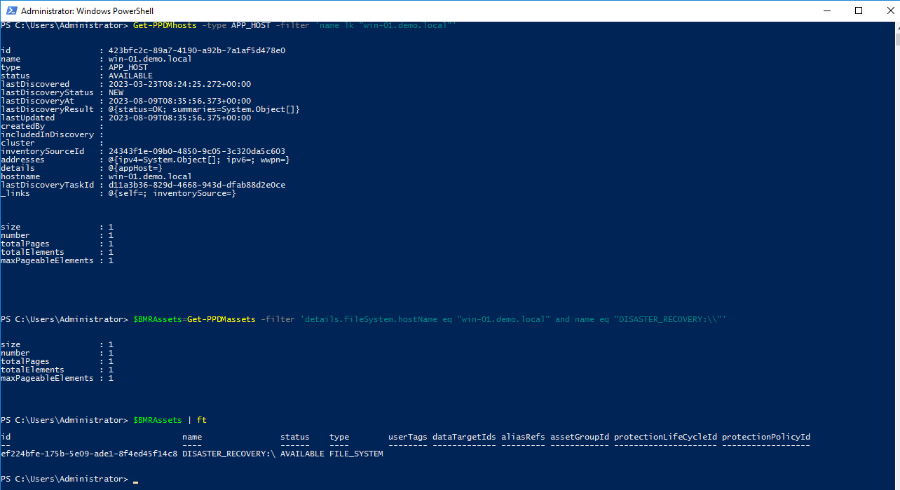
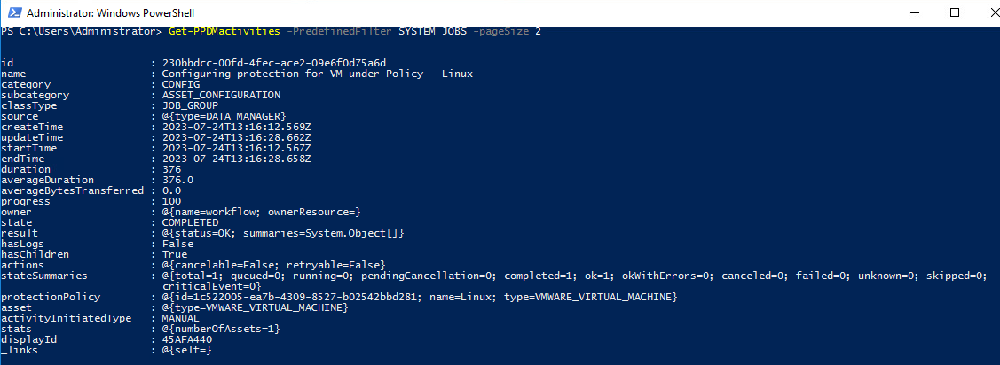
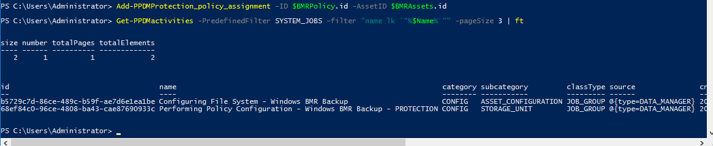
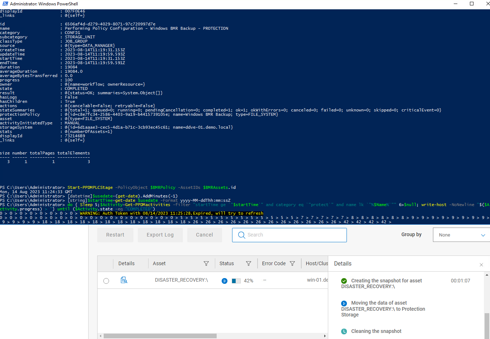

# MODULE 8 - FILESYSTEM BACKUP ENHANCEMENTS -DISASTER RECOVERY BACKUPS AND SUPPORT FOR CLUSTERED FILE SYSTEM -WINDOWS- MODULE OVERVIEW

## LESSON 2 - PERFORM DISASTER RECOVERY BACKUPS, RESTORE SYSTEM STATE AND WINDOWS BARE METAL RECOVERY

In this lesson, we will perform Disaster Recovery Backups, Restore System state and do a Windows Bare Metal Recovery

# This section is WiP

## Review The Assets and Asset Sources

View the Hosts:

```Powershell
Get-PPDMhosts -type APP_HOST -filter 'name lk "win-01.demo.local"'
$BMRAssets=Get-PPDMassets -filter 'details.fileSystem.hostName eq "win-01.demo.local" and name eq "DISASTER_RECOVERY:\\"'
$BMRAssets | ft
```



## Create a new Protection Policy

If not already done from Previous Module, read the Storage System

```Powershell
$StorageSystem=Get-PPDMStorage_systems -Type DATA_DOMAIN_SYSTEM -Filter {name eq "ddve-01.demo.local"}
```

Next, we create a Schedule for the Filesystem Backup

>Backup every : 8 hours
>Retain for : 5 days
>Start Time: 08:00:00 PM
>End Time: 06:00:00 AM

```Powershell
$BMRSchedule=New-PPDMBackupSchedule -hourly -CreateCopyIntervalHrs 8 -RetentionUnit DAY -RetentionInterval 5
```

Next we create a Policy. This time we use name and description as Variables

```Powershell
$Name="Windows BMR Backup"
$Description="Disaster Recovery Backup"
$BMRPolicy=New-PPDMFSBackupPolicy -Schedule $BMRSchedule -Name $NAME -Description $Description -StorageSystemID $StorageSystem.id -enabled -ignoreMissingSystemStateFiles
$BMRPolicy
```


Next we assign the Assets:

```Powershell
Add-PPDMProtection_policy_assignment -ID $BMRPolicy.id -AssetID $BMRAssets.id
```

And Monitor the Activities:

```Powershell
Get-PPDMactivities -PredefinedFilter SYSTEM_JOBS -filter "name lk `"%$Name%`"" -pageSize 3 | ft
```



## Starting the Backup

```Powershell
Start-PPDMPLCStage -PolicyObject $BMRPolicy -AssetIDs $BMRAssets.id
```

Monitor the Backups with:

```Powershell
Get-PPDMactivities -filter "category eq `"protect" and name lk `"%$Name%`"" -pageSize 3
```

```Powershell
[datetime]$usedate=(get-date).AddMinutes(-1)
[string]$startTime=get-date $usedate -Format yyyy-MM-ddThh:mm:ssZ
do { Sleep 5;$Activity=Get-PPDMactivities -filter "startTime ge `"$startTime`" and category eq `"protect`" and name lk `"%$Name%`"" 6>$null; write-host -NoNewline "$($Activity.progress) > "} until ($Activity.state -eq "COMPLETED")
```



Once the Backup is done, we can Proceed with a System State restore

```Powershell
$BMRHost=Get-PPDMhosts -type APP_HOST -filter 'name lk "win-01.demo.local"'
$BMRRestoreAssetCopy=$BMRAssets | Get-PPDMlatest_Copies
$BMRRestoredCopy = New-PPDMRestored_copies -copyobject $BMRRestoreAssetCopy  -Hostid $BMRHost.id
do {
  Start-Sleep -Seconds 10
  $MountedCopy = $BMRRestoredCopy | Get-PPDMRestored_copies
}
until ($MountedCopy.status -eq "SUCCESS") 
```

## Starting the Base Browse

The Base browse will return the .basepath for the fLR Mount(s), a Subdirectory in the Installation Path of DPSAPPS

```Powershell
$Parameters = @{
    HostID               = $BMRHost.id
    BackupTransactionID  = $BMRRestoreAssetCopy.backupTransactionId
    mountURL             = $MountedCopy.restoredCopiesDetails.targetFileSystemInfo.mountUrl
}
$BaseBrowselist = Get-PPDMFSAgentFLRBrowselist @Parameters
$BaseBrowselist
```

With the basePath and the Volumes ( .Sources[]) we can start a Browse for Directories, in this case selected System States

```Powershell
$Parameters = @{
    HostID               = $BMRHost.id
    BackupTransactionID  = $BMRRestoreAssetCopy.backupTransactionId
    mountURL             = "$($BaseBrowselist.basePath)/$($BaseBrowselist.sources[0])"
}
$Browselist = Get-PPDMFSAgentFLRBrowselist @Parameters
$Browselist
```

# We start the Restore of the Complete System State with just the Browselist.Path for complete recover

```Powershell
$Parameters = @{
  CopyObject           = $BMRRestoreAssetCopy
  HostID               = $BMRHost.id 
  RestoreSources       = $Browselist.path
  RestoreLocation      = "DISASTER_RECOVERY:\\"
  RetainFolderHierachy = $true
  conflictStrategy     = "TO_ALTERNATE" 
  CustomDescription    = "Restore from Powershell"
  Verbose              = $false
}

$Restore = Restore-PPDMFileFLR_copies @Parameters
$Restore | Get-PPDMActivities
```

[<<Module 7 Lesson 2](./Module_7_1.md) This Concludes Module 8 Lesson 1 [Module 8 Lesson 2>>](./Module_8_2.md)
