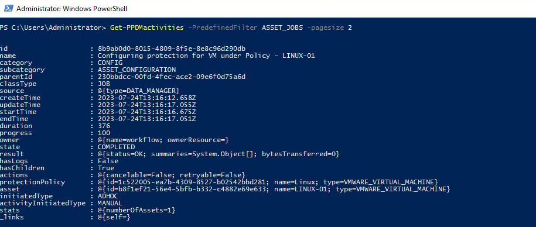

# MODULE 8 - FILESYSTEM BACKUP ENHANCEMENTS -DISASTER RECOVERY BACKUPS AND SUPPORT FOR CLUSTERED FILE SYSTEM -WINDOWS- MODULE OVERVIEW

## LESSON 2 - PERFORM DISASTER RECOVERY BACKUPS, RESTORE SYSTEM STATE AND WINDOWS BARE METAL RECOVERY.

In this lesson, we will perform Disaster Recovery Backups, Restore System state and do a Windows Bare Metal Recovery 


# This section is WiP


## Review The Assets and Asset Sources

View the Hosts:

```Powershell
Get-PPDMhosts -type APP_HOST -filter 'name lk "win-01.demo.local"'
$BMRAssets=Get-PPDMassets -filter 'details.fileSystem.hostName eq "win-01.demo.local" and name eq "DISASTER_RECOVERY:\\"'
$BMRAssets | ft
```


## Create a new Protection Policy

If not already done from Previous Module, read the Storage System

```Powershell
$StorageSystem=Get-PPDMStorage_systems -Type DATA_DOMAIN_SYSTEM -Filter {name eq "ddve-01.demo.local"}
```

Next, we create a Schedule for the Filesystem Backup

>Backup every : 8 hours
>Retain for : 5 days
>Start Time: 08:00:00 PM
>End Time: 06:00:00 AM

```Powershell
$BMRSchedule=New-PPDMBackupSchedule -hourly -CreateCopyIntervalHrs 8 -RetentionUnit DAY -RetentionInterval 5
```

Next we create a Policy. This time we use name and description as Variables

```Powershell
$Name="Windows BMR Backup"
$Description"Disaster Recovery Backup"
$BMRPolicy=New-PPDMFSBackupPolicy -Schedule $BMRSchedule -Name $NAME -Description $Description -StorageSystemID $StorageSystem.id -enabled -ignoreMissingSystemStateFiles
```


Next we assign the Assets:

```Powershell
Add-PPDMProtection_policy_assignment -ID $FSPolicy.id -AssetID $fsAssets.id
```

And Monitor the Activities:

```Powershell
Get-PPDMactivities -PredefinedFilter SYSTEM_JOBS -filter 'name lk "%Windows Cluster%"' -pageSize 3 | ft
```


## Starting the Backup

```Powershell
$FSPolicy | Start-PPDMprotection_policies -BackupType FULL -RetentionUnit DAY -RetentionInterval 5
```

Monitor the Backups with:

```Powershell
Get-PPDMactivities -PredefinedFilter PROTECTION_JOBS -filter 'name lk "%Windows Cluster%"' -pageSize 3
```



[<<Module 7 Lesson 2](./Module_7_1.md) This Concludes Module 8 Lesson 1 [Module 8 Lesson 2>>](./Module_8_2.md)